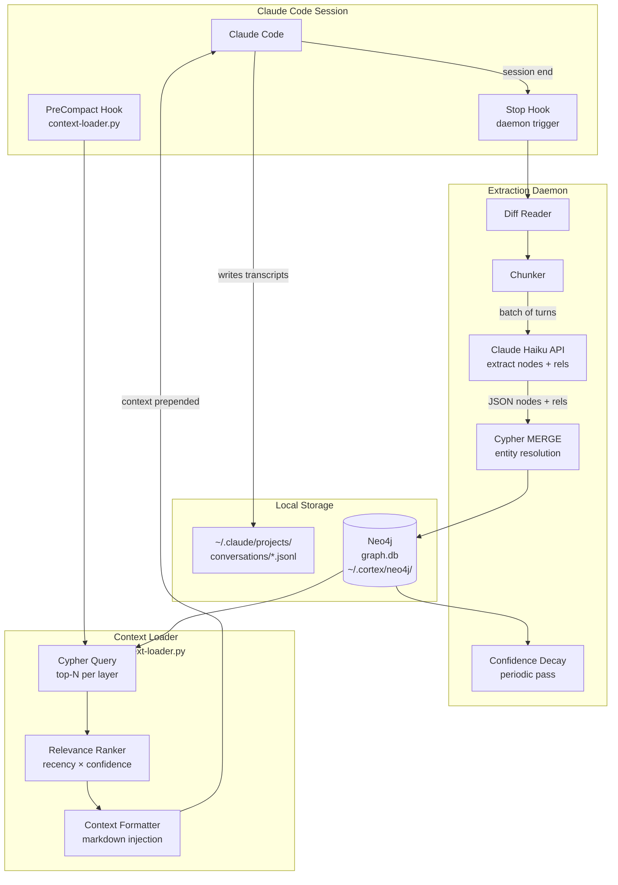

# Cortex

A graph-based persistent memory system for Claude, organized into four semantic layers that are continuously extracted by a Haiku-powered daemon and injected back into AI sessions via Claude Code hooks.

## What is this?

Claude's built-in memory is ephemeral — each session starts cold. Cortex gives Claude a structured, persistent memory that survives across sessions, evolves over time, and retrieves the right context at the right moment.

Instead of flat markdown files, Cortex stores knowledge in **Neo4j** — a native graph database where nodes carry meaning, relationships are first-class citizens, and Cypher queries traverse semantic connections that flat text search can't express. A background daemon powered by **Claude Haiku** continuously reads session transcripts, extracts entities, events, facts, and insights, and merges them into the graph using `MERGE` upserts that deduplicate naturally. At the start of each session, relevant context is queried and injected back into Claude, creating a coherent long-term memory with no manual management required.

The result: Claude accumulates a genuine, evolving understanding of the user — their projects, preferences, history, and thinking — that compounds across every conversation.

## The Four Layers

Memory is organized into four node label types with different semantics, decay rates, and retrieval priorities:

| Layer | Label | Description | Confidence Decay |
|-------|-------|-------------|-----------------|
| **1** | `:Session` | Immediate context — rolling summary of recent sessions, current project state | 24–72 hours |
| **2** | `:Event` | Timestamped series — decisions made, bugs fixed, outcomes, conversations | Days to weeks |
| **3** | `:Fact` / `:Skill` | Durable knowledge — preferences, procedures, project facts, domain knowledge | Long-term; reinforced on reuse |
| **4** | `:Synthesis` | Higher-order — opinions, inferred patterns, cross-session analysis | Long-term; low confidence until reinforced |

Layers are not silos. Relationships connect nodes across them:

```
(synthesis:Synthesis)-[:DERIVED_FROM]->(e1:Event)-[:PART_OF]->(s:Session)
(fact:Fact)-[:CAUSED_BY]->(e2:Event)
(synthesis:Synthesis)-[:SUPPORTS]->(fact:Fact)
```

## System Architecture



## Design Goals

1. **Persistent state** — Claude retains rich context across all sessions without manual re-briefing
2. **Structured retrieval** — multi-hop Cypher traversal surfaces semantically related context that keyword search misses
3. **Automatic curation** — Haiku extracts and consolidates; no manual memory management required
4. **Layered decay** — confidence scores decay at layer-appropriate rates; facts outlast session summaries
5. **Local-first** — all graph data stays on-device via local Neo4j; only transcript diffs are sent to the Haiku API
6. **Composable** — vector embeddings, semantic search via Neo4j vector index, and a visualization layer can be added incrementally

## Tech Stack

| Component | Technology | Why |
|-----------|-----------|-----|
| Graph DB | Neo4j (local Docker) | Native graph storage, Cypher, first-class relationships, vector index for Phase 3 |
| Extraction | Claude Haiku API | Fast, cheap, good at structured JSON extraction |
| Daemon trigger | Claude Code `Stop` hook | Zero-latency trigger at session end without a persistent background process |
| Retrieval trigger | Claude Code `PreCompact` hook | Fires before context is compressed — ideal injection point |
| Python driver | `neo4j` (official) | Async-capable, handles connection pooling |
| Embedding (Phase 3) | Neo4j vector index + `sentence-transformers` | Keep embeddings local; no external embedding API needed |

## Docs

- [Architecture](docs/architecture.md) — component breakdown, data flow, technology rationale
- [Graph Schema](docs/graph-schema.md) — Neo4j labels, relationship types, Cypher schema, example data
- [Extraction Daemon](docs/daemon.md) — Haiku integration, entity resolution, MERGE strategy, confidence decay
- [Context Injection](docs/context-injection.md) — Cypher retrieval, relevance scoring, Claude Code hook setup
- [Roadmap](docs/roadmap.md) — phased implementation plan

## Project Status

Early design phase. See [roadmap](docs/roadmap.md).
