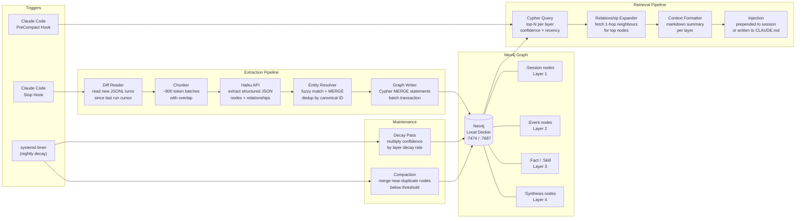

# Architecture

## Overview

Cortex is a pipeline with three distinct concerns: **extraction** (reading sessions and writing to the graph), **retrieval** (reading from the graph and injecting context), and **maintenance** (confidence decay and graph compaction). All three are triggered by Claude Code hooks or a periodic timer — there is no persistent daemon process required.

## Full System Diagram



## Component Breakdown

### 1. Diff Reader

**File:** `src/daemon/diff_reader.py`

Reads Claude Code's conversation transcript files (`~/.claude/projects/*/conversations/*.jsonl`) and emits only turns that haven't been processed yet. Maintains a cursor file (`~/.cortex/cursors.json`) mapping each project path to the last processed offset.

- Input: JSONL file paths
- Output: list of raw turn dicts `{role, content, timestamp, project}`
- State: `~/.cortex/cursors.json`

### 2. Chunker

**File:** `src/daemon/chunker.py`

Groups turns into token-bounded batches (~800 tokens) with a small overlap window so extraction doesn't split mid-thought. Haiku's 200K context easily handles these but smaller batches improve extraction precision.

### 3. Haiku Extractor

**File:** `src/daemon/extractor.py`

Sends each chunk to Claude Haiku with a structured extraction prompt. Returns a JSON object:

```json
{
  "nodes": [
    {
      "label": "Event",
      "id": "evt_freecad_freeze_20260504",
      "content": "FreeCAD froze after startup due to AT-SPI flood",
      "confidence": 0.95,
      "timestamp": "2026-05-04T10:30:00Z",
      "tags": ["freecad", "at-spi", "bug"]
    }
  ],
  "relationships": [
    {
      "from": "evt_freecad_freeze_20260504",
      "to": "fact_atspi_fix",
      "type": "CAUSED_BY"
    }
  ]
}
```

The extraction prompt instructs Haiku to:
- Assign deterministic, slug-style IDs so the same concept always gets the same ID
- Choose the correct layer label based on content semantics
- Set initial confidence (0.0–1.0) based on how certain/explicit the information is
- Extract relationships between nodes, including cross-layer ones

### 4. Entity Resolver

**File:** `src/daemon/resolver.py`

Before writing to Neo4j, each extracted node is checked for duplicates:

1. **Exact ID match** — if a node with the same `id` exists, it's an update (increase confidence, update content if richer)
2. **Fuzzy content match** — compare against existing nodes of the same label using token overlap; merge if similarity > threshold (default 0.85)
3. **New node** — write fresh

Fuzzy matching uses `rapidfuzz` for speed. Phase 3 upgrades this to embedding cosine similarity.

### 5. Graph Writer

**File:** `src/daemon/writer.py`

Translates resolved nodes and relationships into Cypher `MERGE` statements executed in a single transaction:

```cypher
MERGE (n:Event {id: $id})
ON CREATE SET n.content = $content, n.confidence = $confidence, n.createdAt = datetime()
ON MATCH SET n.content = $content, n.confidence = CASE WHEN $confidence > n.confidence THEN $confidence ELSE n.confidence END, n.updatedAt = datetime()
```

### 6. Context Loader

**File:** `src/retrieval/context_loader.py`

Triggered by the `PreCompact` Claude Code hook. Queries Neo4j for the top nodes per layer sorted by `confidence * recency_score` where recency is an exponential decay on `updatedAt`. Also fetches 1-hop neighbours of top nodes to surface connected context.

Output is a markdown-formatted summary injected into the session.

### 7. Decay Pass

**File:** `src/maintenance/decay.py`

Run nightly by a systemd timer. Multiplies each node's `confidence` by its layer's decay factor:

| Layer | Daily decay factor |
|-------|-------------------|
| `:Session` | 0.50 |
| `:Event` | 0.92 |
| `:Fact` / `:Skill` | 0.99 |
| `:Synthesis` | 0.97 |

Nodes with `confidence < 0.05` are archived to a `_archived` label (not deleted) for potential recovery.

## Data Flow Summary

```
Session ends
  → Stop hook fires cortex-daemon.py
  → Diff reader gets new turns
  → Chunker batches them
  → Haiku extracts structured JSON
  → Entity resolver deduplicates
  → Graph writer issues MERGE transactions
  → Neo4j updated

Session starts / compacts
  → PreCompact hook fires context-loader.py
  → Cypher query: top-5 nodes per layer by score
  → 1-hop neighbour expansion
  → Markdown formatted
  → Prepended to session context
```

## Technology Choices

### Neo4j over SQLite + adjacency list

A SQLite adjacency list works for simple graphs but Cortex's value is in **multi-hop traversal** — finding that a current question relates to an event from three sessions ago because they share a common entity. Cypher expresses this in one readable query; SQL requires recursive CTEs or application-level BFS. Neo4j also has a native vector index (for Phase 3 embedding similarity search) and a built-in browser UI for graph visualization.

Local deployment via Docker adds no ongoing cost and keeps all data on-device.

### Claude Haiku for extraction

Haiku is fast (~1–2s per chunk), cheap (< $0.001 per session extraction), and reliable at structured JSON output with a well-designed prompt. Using a sub-model means the main Claude session's context isn't consumed by extraction work.

### Hook-based triggers over a persistent daemon

Claude Code hooks let us trigger extraction exactly when something has happened (session end) without a persistent background process consuming resources. The Stop hook fires after every session; the PreCompact hook fires before context compression — the right moment to inject fresh memory.
