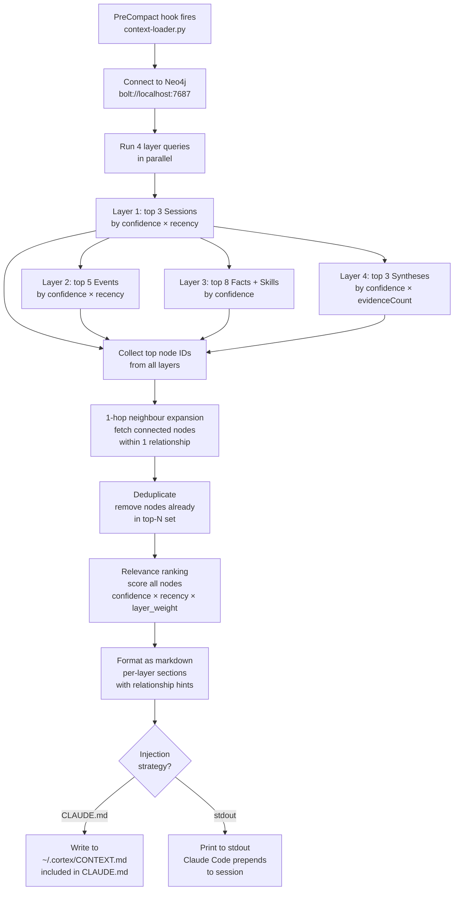

# Context Injection

## Overview

Context injection is the retrieval side of Cortex — querying the Neo4j graph at the start of each session and feeding the most relevant memory back into Claude. It runs as a short-lived script triggered by a Claude Code `PreCompact` hook, which fires just before Claude compresses its context window — the ideal moment to inject fresh, relevant memory.

## Trigger

```json
{
  "hooks": {
    "PreCompact": [
      {
        "matcher": "",
        "hooks": [
          {
            "type": "command",
            "command": "python3 ~/.cortex/src/retrieval/context_loader.py"
          }
        ]
      }
    ]
  }
}
```

The script writes its output to a file that Claude Code reads on startup or after compaction. The exact injection mechanism depends on the configured strategy (see [Injection Strategies](#injection-strategies) below).

## Retrieval Flow



## Relevance Scoring

Each candidate node receives a composite score:

```python
def relevance_score(node, layer_weight):
    age_days = (now - node["updatedAt"]).days
    recency = math.exp(-age_days / HALF_LIFE[node.label])
    return node["confidence"] * recency * layer_weight

LAYER_WEIGHTS = {
    "Session":   1.0,   # most immediately relevant
    "Event":     0.85,
    "Fact":      0.9,   # durable value; slight boost
    "Skill":     0.9,
    "Synthesis": 0.75,  # valuable but lower confidence by design
}

HALF_LIFE = {          # in days, for recency decay
    "Session":   1.5,
    "Event":     7.0,
    "Fact":      60.0,
    "Skill":     60.0,
    "Synthesis": 20.0,
}
```

## Neighbour Expansion

After selecting top-N nodes per layer, fetch their direct neighbours:

```cypher
MATCH (n)-[r]-(neighbour)
WHERE n.id IN $top_node_ids
  AND NOT neighbour:_Archived
  AND neighbour.confidence > 0.3
RETURN n.id AS source, type(r) AS rel, r.weight AS weight, neighbour
ORDER BY r.weight DESC
LIMIT 30
```

Neighbours are added to the context if they provide information not already in the top-N set. This surfaces implicit connections — e.g., an Event that CAUSED_BY a Fact that's already high-confidence but whose causal chain is relevant context.

## Output Format

The context loader produces a markdown block injected into the session:

```markdown
<!-- CORTEX MEMORY — auto-generated, do not edit -->

## Current Context (Layer 1)
- **[2026-05-04]** Session: Debugged FreeCAD freeze. Root cause: AT-SPI flood. Fix: restart at-spi processes. Confirmed working.

## Recent Events (Layer 2)
- **[2026-05-04]** FreeCAD froze after startup due to qt.accessibility.atspi errors → fixed by restarting AT-SPI (confidence: 0.99)
- **[2026-05-01]** Installed grill-me skill from mattpocock/skills via npx (confidence: 0.95)
- **[2026-04-29]** Set up XR virtual desktop project for Viture XR Pro on GNOME 46/Wayland (confidence: 0.90)

## Knowledge Base (Layer 3)
- **[fact]** FreeCAD AT-SPI fix: `pkill -f at-spi-bus-launcher; pkill -f at-spi2-registryd` — do NOT use QT_ACCESSIBILITY=0 (confidence: 0.98)
- **[fact]** gh CLI at ~/.local/bin/gh, HTTPS auth, git config set for ProjectBlueSkies (confidence: 0.97)
- **[skill]** Restart AT-SPI: pkill both processes; GNOME auto-relaunches; wait 2s then retry (confidence: 0.96)

## Patterns & Analysis (Layer 4)
- FreeCAD AT-SPI freezes are recurring (2+ occurrences). Likely triggered by Wayland/XWayland transitions or system resume (confidence: 0.65, 2 events)

<!-- Related: evt_grill_me_install → fact_claude_code_skills_dir -->
<!-- END CORTEX MEMORY -->
```

The `<!-- Related: -->` hints tell Claude which nodes are connected without cluttering the main context.

## Injection Strategies

### Strategy A: CLAUDE.md inclusion (recommended for now)

Add to `~/.claude/CLAUDE.md`:

```markdown
<!-- Dynamic context — updated by Cortex before each session -->
{{file:~/.cortex/CONTEXT.md}}
```

The context loader writes to `~/.cortex/CONTEXT.md`. Claude Code reads CLAUDE.md at session start, which includes the latest context.

**Pros:** Simple, always available, survives restarts.
**Cons:** Static — doesn't update mid-session.

### Strategy B: PreCompact stdout injection

The context loader prints to stdout; Claude Code's PreCompact hook prepends it to the session before compaction.

**Pros:** Dynamic — refreshed at each compaction cycle.
**Cons:** Requires Claude Code to support stdout injection from hooks (verify in your version).

### Strategy C: Hook writes to a temp file

The hook writes context to a temp file, and a custom CLAUDE.md snippet reads it. Combines the reliability of A with slightly fresher updates.

## Context Budget

The injected context is kept under a configurable token budget (default: 800 tokens) to avoid consuming too much of Claude's context window. If the full context exceeds the budget, nodes are ranked by relevance score and the lowest-scoring ones are dropped first, with a note indicating truncation.

```python
MAX_CONTEXT_TOKENS = 800

def trim_to_budget(sections: list[str], max_tokens: int) -> str:
    result = []
    used = 0
    for section in sections:
        tokens = estimate_tokens(section)
        if used + tokens > max_tokens:
            result.append(f"<!-- {max_tokens - used} tokens remaining — {len(sections) - len(result)} sections omitted -->")
            break
        result.append(section)
        used += tokens
    return "\n\n".join(result)
```

## Reinforcement on Read

When a node is included in injected context, its `confidence` receives a small boost (default +0.02) to model the reinforcement effect of a memory being actively used:

```cypher
MATCH (n) WHERE n.id IN $injected_ids
SET n.confidence = CASE 
  WHEN n.confidence + 0.02 > 1.0 THEN 1.0 
  ELSE n.confidence + 0.02 
END,
n.updatedAt = datetime()
```

This means frequently-retrieved facts stay high-confidence even as the decay pass runs, while unused facts naturally fade.
