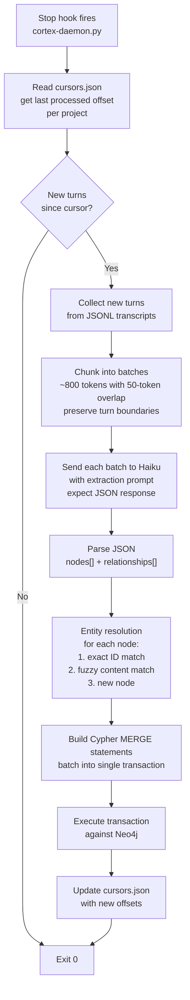

# Extraction Daemon

## Overview

The extraction daemon reads Claude Code session transcripts, sends them to Claude Haiku for structured extraction, resolves entities against existing graph nodes, and writes the results to Neo4j via Cypher `MERGE` statements. It runs as a short-lived script triggered by a Claude Code `Stop` hook — no persistent process required.

## Trigger Mechanism

The daemon is invoked by a Claude Code `Stop` hook configured in `~/.claude/settings.json`:

```json
{
  "hooks": {
    "Stop": [
      {
        "matcher": "",
        "hooks": [
          {
            "type": "command",
            "command": "python3 ~/.cortex/src/daemon/main.py"
          }
        ]
      }
    ]
  }
}
```

Alternatively, for guaranteed execution even on abnormal exits, a `systemd` timer can trigger it every 15 minutes (see [Setup](#setup)).

## Extraction Flow



## Haiku Extraction Prompt

The system prompt instructs Haiku on schema, ID conventions, and output format. The user turn is the raw conversation chunk.

```
You are a memory extraction engine. Given a chunk of conversation between a user and Claude, extract structured memory nodes and relationships for a graph database.

OUTPUT: Return only valid JSON, no markdown, no explanation.

SCHEMA:
Node labels: Session, Event, Fact, Skill, Synthesis
- Session: summary of what happened in a work session
- Event: a discrete timestamped occurrence (bug fixed, command run, decision made, error encountered)
- Fact: durable knowledge that doesn't expire (user preferences, project config, technical solutions)
- Skill: procedural knowledge with steps (how to do something)
- Synthesis: higher-order pattern or opinion inferred from multiple events

Node properties: id (slug, deterministic), content (string), confidence (0.0-1.0), label, tags (string[])
Events also need: timestamp (ISO 8601), outcome (success|failure|in_progress|unknown)
Skills also need: steps (markdown numbered list)

ID convention: {label_prefix}_{topic}_{YYYYMMDD}
  Examples: evt_freecad_freeze_20260504, fact_atspi_fix_method, sess_20260504_morning

Relationship types: PART_OF, CAUSED_BY, DERIVED_FROM, SUPPORTS, CONTRADICTS, RELATED_TO, SUPERSEDES, REQUIRES
Each relationship: { from: id, to: id, type: string, weight: 0.0-1.0 }

RULES:
- Only extract information that is clearly stated or directly implied
- Use deterministic IDs — the same concept must always produce the same ID
- Confidence reflects certainty: explicit = 0.9+, implied = 0.6-0.8, speculative = 0.3-0.5
- Prefer fewer high-quality nodes over many low-quality ones
- If the chunk contains nothing worth remembering, return {"nodes": [], "relationships": []}

OUTPUT FORMAT:
{
  "nodes": [ { "id": "...", "label": "...", "content": "...", "confidence": 0.9, "tags": [] } ],
  "relationships": [ { "from": "...", "to": "...", "type": "...", "weight": 0.8 } ]
}
```

## Entity Resolution

Before writing to Neo4j, each extracted node is resolved against existing graph nodes to prevent duplicates:

### Resolution Algorithm

```python
def resolve_node(extracted_node, neo4j_session):
    # 1. Exact ID match — strongest signal
    existing = neo4j_session.run(
        "MATCH (n {id: $id}) RETURN n", id=extracted_node["id"]
    ).single()
    if existing:
        return ("update", existing["n"])

    # 2. Fuzzy content match within same label
    candidates = neo4j_session.run(
        f"MATCH (n:{extracted_node['label']}) RETURN n.id, n.content"
    ).data()
    
    for candidate in candidates:
        similarity = token_overlap(extracted_node["content"], candidate["n.content"])
        if similarity > FUZZY_THRESHOLD:  # default 0.85
            return ("merge", candidate["n.id"])

    # 3. New node
    return ("create", None)
```

**Phase 3 upgrade:** Replace `token_overlap` with embedding cosine similarity using Neo4j's vector index for semantically equivalent but differently worded nodes.

## Cypher MERGE Strategy

```cypher
// Create or update a node
MERGE (n:{label} {{ id: $id }})
ON CREATE SET
  n.content = $content,
  n.confidence = $confidence,
  n.createdAt = datetime(),
  n.updatedAt = datetime(),
  n.tags = $tags
ON MATCH SET
  n.content = CASE WHEN $confidence > n.confidence THEN $content ELSE n.content END,
  n.confidence = CASE WHEN $confidence > n.confidence THEN $confidence ELSE n.confidence END,
  n.updatedAt = datetime(),
  n.tags = $tags

// Create relationship (idempotent)
MATCH (a {{ id: $from_id }}), (b {{ id: $to_id }})
MERGE (a)-[r:{rel_type}]->(b)
ON CREATE SET r.weight = $weight, r.createdAt = datetime()
ON MATCH SET r.weight = (r.weight + $weight) / 2.0
```

Key behaviors:
- Higher-confidence extractions win on content conflicts
- Relationship weights are averaged on re-encounter (reinforcement)
- All writes are in a single transaction per daemon run

## Confidence Decay

The decay pass runs nightly (or can be called manually). Each layer decays at a different rate:

```python
DECAY_RATES = {
    "Session":   0.50,  # half-life ~1.4 days
    "Event":     0.92,  # half-life ~8.3 days
    "Fact":      0.99,  # half-life ~69 days
    "Skill":     0.99,
    "Synthesis": 0.97,  # half-life ~23 days
}
```

```cypher
// Example decay pass for Events
MATCH (n:Event)
SET n.confidence = n.confidence * $decay_factor

// Archive nodes below threshold (don't delete — keep for potential recovery)
MATCH (n)
WHERE n.confidence < 0.05
SET n:_Archived
REMOVE n:Session, n:Event, n:Fact, n:Skill, n:Synthesis
```

Nodes are never hard-deleted; they are relabelled `:_Archived`. This allows the daemon to un-archive them if a future session re-introduces the same information.

## Setup

### Docker (recommended)

```bash
# Pull and start Neo4j
docker run -d \
  --name cortex-neo4j \
  --restart unless-stopped \
  -p 7474:7474 -p 7687:7687 \
  -v ~/.cortex/neo4j/data:/data \
  -e NEO4J_AUTH=neo4j/cortex_local \
  neo4j:5

# Verify
curl http://localhost:7474
```

### Environment

```bash
# ~/.cortex/.env
NEO4J_URI=bolt://localhost:7687
NEO4J_USER=neo4j
NEO4J_PASSWORD=cortex_local
ANTHROPIC_API_KEY=sk-ant-...
CORTEX_HOME=~/.cortex
```

### systemd timer (optional, belt-and-suspenders)

`~/.config/systemd/user/cortex-daemon.timer`:

```ini
[Unit]
Description=Cortex memory extraction timer

[Timer]
OnCalendar=*:0/15
Persistent=true

[Install]
WantedBy=timers.target
```

```bash
systemctl --user enable --now cortex-daemon.timer
```
