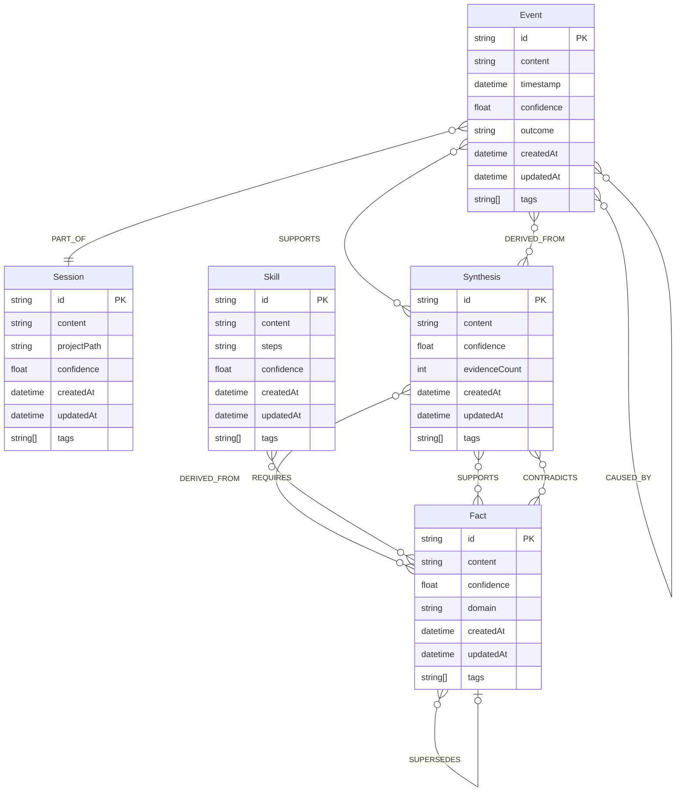

# Graph Schema

## Overview

Cortex uses Neo4j with a labelled property graph model. Each memory layer maps to one or two node labels. Relationships are first-class graph citizens (not rows in a join table), enabling expressive multi-hop Cypher queries.

## Node Labels

### `:Session` — Layer 1

Ephemeral rolling summaries of recent sessions. Created at the end of every session; confidence decays quickly so only the most recent sessions stay relevant.

| Property | Type | Description |
|----------|------|-------------|
| `id` | String | Unique slug, e.g. `sess_20260504_freecad` |
| `content` | String | Summary of the session — what happened, decisions made |
| `projectPath` | String | Claude Code project path this session belongs to |
| `confidence` | Float | 0.0–1.0; starts at 1.0, decays 50%/day |
| `createdAt` | DateTime | When the session ended |
| `updatedAt` | DateTime | Last time this node was touched |
| `tags` | String[] | Topic tags for retrieval filtering |

### `:Event` — Layer 2

Timestamped discrete occurrences: a bug fixed, a decision made, a file created, a tool run. The backbone of chronological memory.

| Property | Type | Description |
|----------|------|-------------|
| `id` | String | Deterministic slug, e.g. `evt_atspi_fix_20260504` |
| `content` | String | What happened |
| `timestamp` | DateTime | When the event occurred |
| `confidence` | Float | 0.0–1.0; decays 8%/day |
| `outcome` | String | `success`, `failure`, `in_progress`, `unknown` |
| `createdAt` | DateTime | |
| `updatedAt` | DateTime | |
| `tags` | String[] | |

### `:Fact` — Layer 3

Durable, timeless knowledge: preferences, configuration details, project facts, decisions-with-rationale that don't expire.

| Property | Type | Description |
|----------|------|-------------|
| `id` | String | e.g. `fact_atspi_fix_method` |
| `content` | String | The fact itself |
| `confidence` | Float | Starts at extraction confidence; reinforced on re-encounter |
| `domain` | String | `user`, `project`, `technical`, `preference` |
| `createdAt` | DateTime | |
| `updatedAt` | DateTime | |
| `tags` | String[] | |

### `:Skill` — Layer 3

Procedural knowledge: how to do something, command sequences, recipes. Treated like Facts but with a `steps` property.

| Property | Type | Description |
|----------|------|-------------|
| `id` | String | e.g. `skill_restart_atspi` |
| `content` | String | Summary of the skill |
| `steps` | String | Step-by-step procedure (markdown) |
| `confidence` | Float | |
| `createdAt` | DateTime | |
| `updatedAt` | DateTime | |
| `tags` | String[] | |

### `:Synthesis` — Layer 4

Higher-order inferences: patterns across events, opinions, user model attributes, cross-session analysis. Created by the daemon when it detects recurring themes or by explicit synthesis prompts.

| Property | Type | Description |
|----------|------|-------------|
| `id` | String | e.g. `synth_user_prefers_local_tools` |
| `content` | String | The synthesized insight |
| `confidence` | Float | Starts low (0.3–0.5); reinforced when evidence accumulates |
| `evidenceCount` | Integer | Number of supporting nodes |
| `createdAt` | DateTime | |
| `updatedAt` | DateTime | |
| `tags` | String[] | |

## Relationship Types

| Type | Direction | Meaning |
|------|-----------|---------|
| `PART_OF` | Event → Session | This event occurred during this session |
| `CAUSED_BY` | Event → Event / Fact | This event was caused by this other event or fact |
| `DERIVED_FROM` | Synthesis → Event / Fact | This synthesis is inferred from these nodes |
| `SUPPORTS` | Event / Fact → Synthesis | This evidence supports this synthesis |
| `CONTRADICTS` | Fact / Event → Synthesis | This contradicts this synthesis (triggers confidence drop) |
| `RELATED_TO` | Any → Any | General semantic relatedness |
| `SUPERSEDES` | Fact → Fact | This fact replaces an older, now-invalid fact |
| `REQUIRES` | Skill → Fact / Skill | This skill depends on this prerequisite knowledge |

All relationships carry:
- `weight` (Float, 0.0–1.0) — strength of the relationship
- `createdAt` (DateTime)

## Schema Setup (Cypher)

```cypher
// Uniqueness constraints
CREATE CONSTRAINT session_id IF NOT EXISTS FOR (n:Session) REQUIRE n.id IS UNIQUE;
CREATE CONSTRAINT event_id IF NOT EXISTS FOR (n:Event) REQUIRE n.id IS UNIQUE;
CREATE CONSTRAINT fact_id IF NOT EXISTS FOR (n:Fact) REQUIRE n.id IS UNIQUE;
CREATE CONSTRAINT skill_id IF NOT EXISTS FOR (n:Skill) REQUIRE n.id IS UNIQUE;
CREATE CONSTRAINT synthesis_id IF NOT EXISTS FOR (n:Synthesis) REQUIRE n.id IS UNIQUE;

// Indexes for retrieval performance
CREATE INDEX session_updated IF NOT EXISTS FOR (n:Session) ON (n.updatedAt);
CREATE INDEX event_timestamp IF NOT EXISTS FOR (n:Event) ON (n.timestamp);
CREATE INDEX fact_domain IF NOT EXISTS FOR (n:Fact) ON (n.domain);
CREATE INDEX node_confidence IF NOT EXISTS FOR (n:Session) ON (n.confidence);
CREATE INDEX node_confidence IF NOT EXISTS FOR (n:Event) ON (n.confidence);
CREATE INDEX node_confidence IF NOT EXISTS FOR (n:Fact) ON (n.confidence);
CREATE INDEX node_confidence IF NOT EXISTS FOR (n:Synthesis) ON (n.confidence);

// Phase 3: Vector index for embedding similarity search
// CREATE VECTOR INDEX node_embeddings IF NOT EXISTS FOR (n:Fact) ON n.embedding
//   OPTIONS { indexConfig: { `vector.dimensions`: 384, `vector.similarity_function`: 'cosine' } };
```

## Entity-Relationship Diagram



## Example Subgraph

A real subgraph from the FreeCAD AT-SPI incident:

```cypher
// Session node
(:Session {
  id: "sess_20260504_freecad_debug",
  content: "Debugged FreeCAD freeze on startup. Identified AT-SPI flood as root cause. Resolved by restarting at-spi processes.",
  confidence: 0.95,
  createdAt: datetime("2026-05-04T10:45:00Z")
})

// Events
(:Event {
  id: "evt_freecad_freeze_20260504",
  content: "FreeCAD froze after startup with qt.accessibility.atspi errors",
  timestamp: datetime("2026-05-04T10:30:00Z"),
  outcome: "failure",
  confidence: 0.99
})

(:Event {
  id: "evt_atspi_restart_fix_20260504",
  content: "Restarted at-spi-bus-launcher and at-spi2-registryd; FreeCAD launched successfully",
  timestamp: datetime("2026-05-04T10:42:00Z"),
  outcome: "success",
  confidence: 0.99
})

// Durable fact
(:Fact {
  id: "fact_atspi_fix_method",
  content: "FreeCAD flatpak AT-SPI flood fixed by: pkill -f at-spi-bus-launcher; pkill -f at-spi2-registryd. GNOME relaunches them fresh. Do NOT use QT_ACCESSIBILITY=0 or NO_AT_BRIDGE=1.",
  domain: "technical",
  confidence: 0.98
})

// Skill
(:Skill {
  id: "skill_restart_atspi",
  content: "Restart AT-SPI accessibility processes",
  steps: "1. `pkill -f at-spi-bus-launcher`\n2. `pkill -f at-spi2-registryd`\n3. GNOME auto-relaunches both. Wait 2s then retry."
})

// Synthesis
(:Synthesis {
  id: "synth_freecad_atspi_recurring",
  content: "FreeCAD AT-SPI freezes recur periodically (2nd occurrence). Pattern: at-spi processes enter broken state after system resume or display switch. Likely related to Wayland/XWayland switching.",
  confidence: 0.65,
  evidenceCount: 2
})

// Relationships
(evt_freecad_freeze)-[:PART_OF]->(sess_20260504)
(evt_atspi_restart_fix)-[:PART_OF]->(sess_20260504)
(evt_atspi_restart_fix)-[:CAUSED_BY {weight: 0.9}]->(fact_atspi_fix_method)
(synth_freecad_atspi_recurring)-[:DERIVED_FROM {weight: 0.8}]->(evt_freecad_freeze)
(skill_restart_atspi)-[:REQUIRES]->(fact_atspi_fix_method)
```

## Retrieval Queries

### Top-N nodes per layer (context loader)

```cypher
// Layer 1: Recent sessions
MATCH (n:Session)
RETURN n
ORDER BY n.confidence * (1.0 / (1 + duration.between(n.updatedAt, datetime()).days)) DESC
LIMIT 3

// Layer 2: Recent high-confidence events
MATCH (n:Event)
RETURN n
ORDER BY n.confidence * (1.0 / (1 + duration.between(n.timestamp, datetime()).days)) DESC
LIMIT 5

// Layer 3: Durable facts and skills
MATCH (n) WHERE n:Fact OR n:Skill
RETURN n ORDER BY n.confidence DESC LIMIT 8

// Layer 4: Synthesis nodes
MATCH (n:Synthesis)
RETURN n ORDER BY n.confidence * n.evidenceCount DESC LIMIT 3
```

### 1-hop neighbour expansion

```cypher
MATCH (n)-[r]-(neighbour)
WHERE n.id IN $topNodeIds
RETURN n, r, neighbour
```
